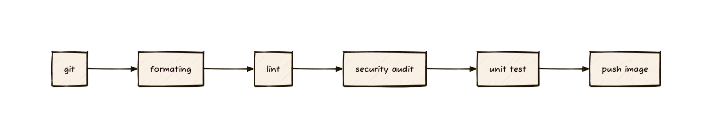

## Alur kerja CI kami mencakup beberapa lapisan pertahanan untuk menjaga integritas kode:




- Audit Dependensi: Menggunakan cargo-audit untuk memeriksa kerentanan (CVE) pada crate pihak ketiga.
- Static Analysis (SAST): Menjalankan clippy untuk menangkap anti-patterns dan potensi bug keamanan.
- Secret Scanning: Memastikan tidak ada kredensial yang bocor dalam repositori.
- Runtime Safety: Menjalankan unit tests secara otomatis di lingkungan terisolasi.
- Formatting Check: Memastikan konsistensi gaya kode dengan rustfmt.
- Auto-Versioning: Menggunakan Git Tags atau Patch increments untuk menentukan versi image.
- Multi-Stage Builds: Memastikan image akhir hanya berisi binary hasil compile (ukuran kecil & lebih aman).
- Security Scanning: Memastikan image Docker tidak memiliki kerentanan sistem operasi.

## Menambahakan  secret menggunakan gh cli 

```bash

gh secret set DOCKERHUB_USERNAME --body "username"

gh secret set DOCKERHUB_TOKEN --body "token_docker_hub"

```

## menbahakan kube cluster local 

```bash

kind create cluster --config kind-config.yaml

# menambahkan ingress
kubectl apply -f https://raw.githubusercontent.com/kubernetes/ingress-nginx/main/deploy/static/provider/kind/deploy.yaml
```

## apply manifest 

```bash

kubectl apply -f k8s/ -R
    
```
